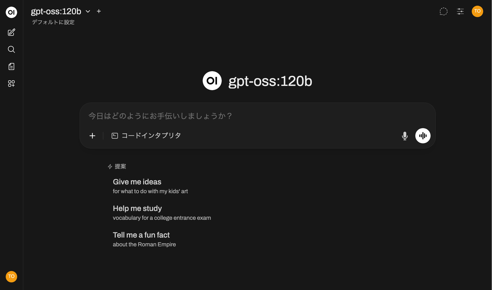
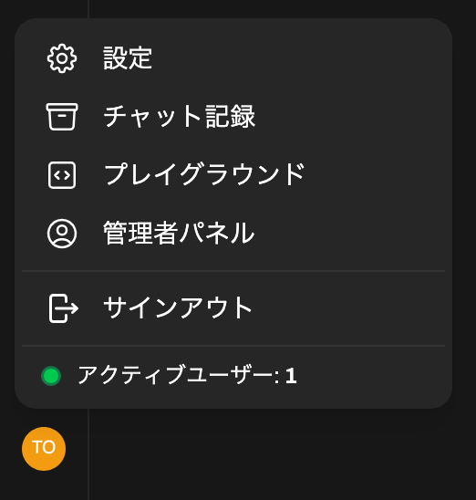
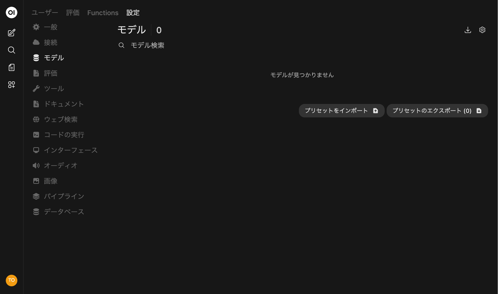
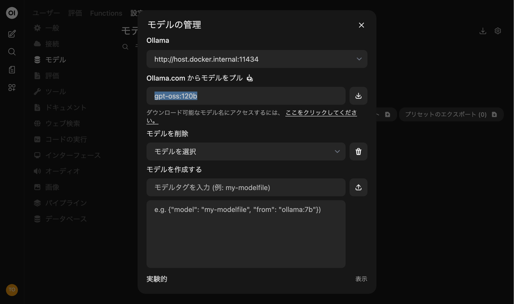
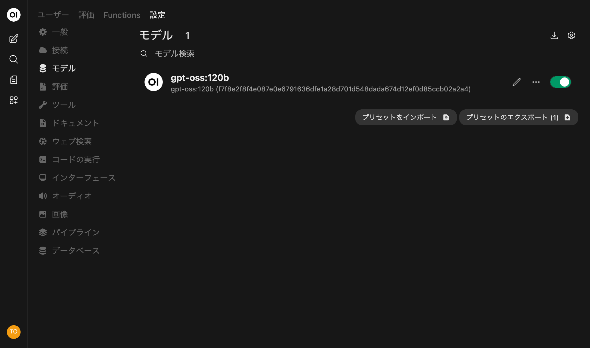
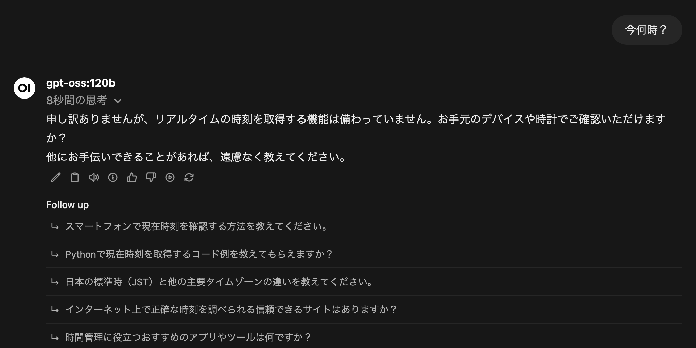
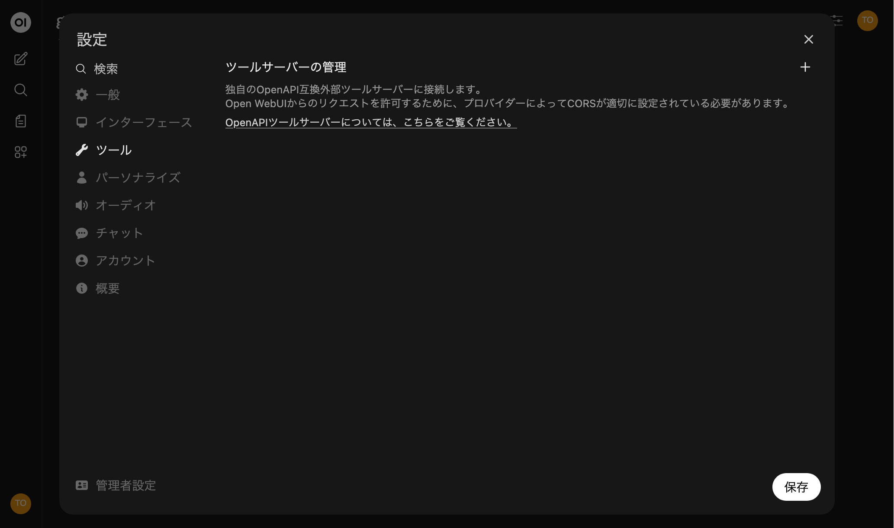
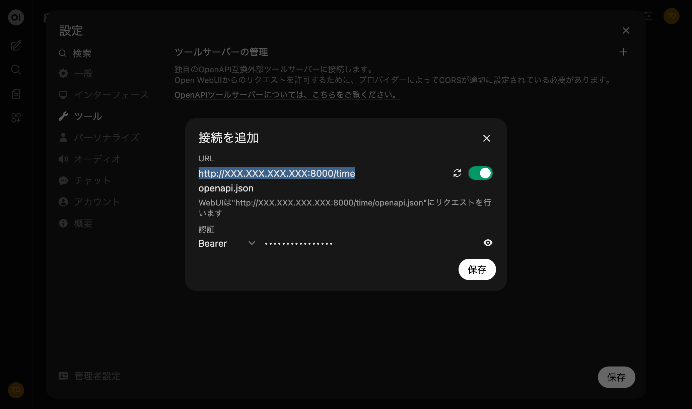
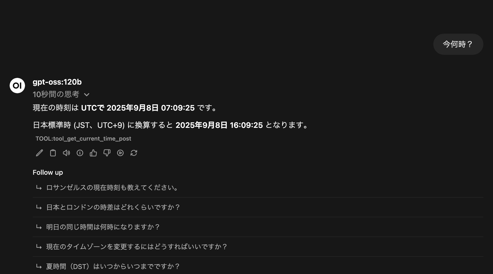

# Open WebUIでLLM

[Open WebUI](https://openwebui.com/) + LLMでチャット！



## 前提

[こちら](../README.md)の「事前準備」が一通り終わっているものとします。

- 「高火力 VRT/24Core-240GB-H100x1」のインスタンスが作成されている
- CUDA Toolkit / NVIDIA Driverがインストールされている
- 「Dockerを使う場合」の準備も終わっている

## 手順

### NVMeストレージのセットアップ

以下のコマンドを実行してください。
NVMeストレージがマウントされ、 `/mnt/nvme/ollama_models` でアクセスできるようになります。

```bash
sudo mkdir /mnt/nvme
sudo mkfs.xfs /dev/nvme0n1
sudo mount /dev/nvme0n1 /mnt/nvme
sudo mkdir /mnt/nvme/ollama_models
```

### Open WebUI + Ollama起動

このREADMEがあるディレクトリー（ `openwebui` ）に移動し、以下のコマンドを実行してください。
8080/TCPでOpen WebUIが、11434/TCPでOllamaが起動します。

```bash
docker compose up -d

# コマンド実行にroot権限が必要な場合はこちら
sudo docker compose up -d
```

Dockerのバージョンが古いと、上記コマンドで起動できない場合があります。
その場合は以下のコマンドを実行してください。

```bash
docker-compose up -d

# コマンド実行にroot権限が必要な場合はこちら
sudo docker-compose up -d
```

必要なイメージやファイルのダウンロードが行われるので、起動までしばらく時間がかかります。

ダウンロードされたモデルは `/mnt/nvme/ollama_models` に格納されます。

### Open WebUIにアクセス

サービス起動後、<http://サーバーのIPアドレス:8080>にアクセスするとOpen WebUIの画面が表示されます。

初回アクセス時に管理者用アカウントの作成を求められますので、アカウントを作成してください。

### モデルのインストール

1. 左下のアイコン→「管理者パネル」

    

1. 「設定」→「モデル」→「モデルの管理（右上のアイコン）」

    

1. 「Ollama.com からモデルをプル」のモデルタグ入力欄に、[Ollama Library](https://ollama.com/library)にあるモデル（ `gpt-oss-120b`, `gemma3:27b` など）を入力して右のダウンロードボタンをクリック

    

1. 入力したモデルが使えるようになりました

    

### いざ、チャット！

ここまでできたらチャットの準備完了です。
思う存分、LLMとの会話を楽しみましょう！

処理はサーバー内で完結し、データはサーバーの外に一切出ないので安心です。

システムプロンプトの例:

```text
あなたはどんな文章も五七五七七で表現できる短歌の天才です。これから私が入力する文章を全て五七五七七で表現してください。
```

## おまけ: ツールサーバーとの連携

このままでは、LLMは「知っていること」にしか答えられません。
たとえば現在時刻を聞いても「わからない」と答えるか、今まで学習したデータの中に「今はHH時MM分」という情報があれば、それを答えてしまいます。

ツールサーバーを使うと、人間のように「知らないことは知っている人に聞く」「時間を聞かれたら時計を見る」といった外部情報を活用できるようになります。
（ただし、一部の情報が外に出る場合があります）



### ツールサーバーの起動

以下のコマンドを実行してください。
8000/TCPで `time` （現在時刻を取得するツール）と `fetch` （指定のURLから情報を取得するツール）が使えるようになります。
`SECRET-API-KEY` の部分（APIキー）は適宜変更してください。

```bash
cd mcpo
sudo apt install pipenv
sudo pipenv install
sudo pipenv run mcpo --port 8000 --api-key "SECRET-API-KEY" --config mcpo-config.json
```

### Open WebUIからツールサーバーを使えるようにする

1. 左下のアイコン→「設定」

    

1. 「ツール」→右上の「＋」

    

1. `URL` にツールサーバーのURL（<http://サーバーのIPアドレス:8000/time>, <http://サーバーのIPアドレス:8000/fetch>）を、「認証」に先ほどのAPIキーを指定

    

### 試してみる

ツールサーバーに問い合わせて時間が返ってきました！


